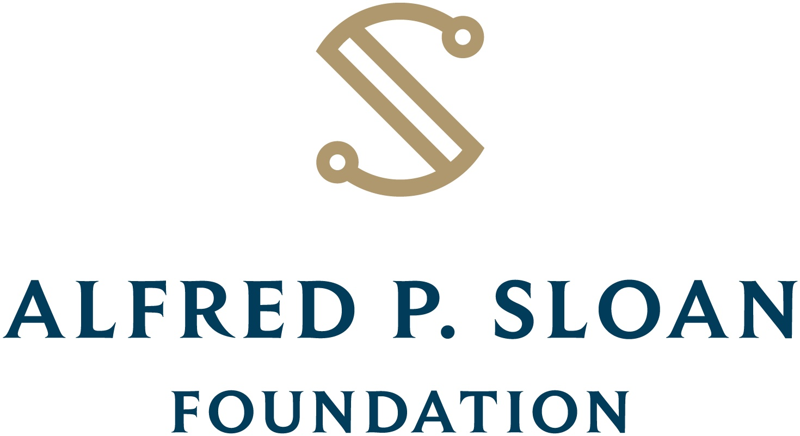

<p align="center">
  <a href="https://github.com/privacy-tech-lab/gpc-web-ui/releases"></a>
  <a href="https://github.com/privacy-tech-lab/gpc-web-ui/releases"></a>
  <a href="https://github.com/privacy-tech-lab/gpc-web-ui/commits/main"></a>
  <a href="https://github.com/privacy-tech-lab/gpc-web-ui/issues"></a>
  <a href="https://github.com/privacy-tech-lab/gpc-web-ui/issues?q=is%3Aissue+is%3Aclosed"></a>
  <a href="https://github.com/privacy-tech-lab/gpc-web-ui/blob/main/LICENSE.md"></a>
  <a href="https://github.com/privacy-tech-lab/gpc-web-ui/watchers"></a>
  <a href="https://github.com/privacy-tech-lab/gpc-web-ui/stargazers"></a>
  <a href="https://github.com/privacy-tech-lab/gpc-web-ui/network/members"></a>
  <a href="https://github.com/sponsors/privacy-tech-lab"></a>
</p>

<p align="center">
  <a href="https://privacytechlab.org/"></a>
</p>

# GPC Web UI

The GPC Web UI is developed and maintained by the [OptMeowt team](https://github.com/privacy-tech-lab/gpc-optmeowt#optmeowt-).

[1. Introduction](#1-introduction)  
[2. Instructions for Running Locally](#2-instructions-for-running-locally)  
[3. Adding New Data](#3-adding-new-data)  
[4. Thank You!](#4-thank-you)

## 1. Introduction

Code for showing GPC crawl results in an interactive user interface on the web.

Currently deployed on vercel at [gpc-web-ui.vercel.app](https://gpc-web-ui.vercel.app).

## 2. Instructions for Running Locally

Run the following command to clone this repository locally:

```console
git clone https://github.com/privacy-tech-lab/gpc-web-ui.git
```

Navigate to the client directory

```console
cd client
```

Run these commands, then navigate to the localhost link provided in your terminal to see the UI displayed:

```console
npm i
npm run dev
```

## 3. Adding New Data

Follow tutorial on the repository [wiki](https://github.com/privacy-tech-lab/gpc-web-ui/wiki/Instructions-for-Uploading-Data).

## 4. Thank You!

<p align="center"><strong>We would like to thank our supporters!</strong></p><br>

<p align="center">Major financial support provided by the National Science Foundation.</p>

<p align="center">
  <a href="https://nsf.gov/awardsearch/showAward?AWD_ID=2055196">
    
  </a>
</p>

<p align="center">Additional financial support provided by the Alfred P. Sloan Foundation, Wesleyan University, and the Anil Fernando Endowment.</p>

<p align="center">
  <a href="https://sloan.org/grant-detail/9631">
    
  </a>
  <a href="https://www.wesleyan.edu/mathcs/cs/index.html">
    
  </a>
</p>

<p align="center">Conclusions reached or positions taken are our own and not necessarily those of our financial supporters, its trustees, officers, or staff.</p>

##

<p align="center">
  <a href="https://privacytechlab.org/"></a>
<p>
